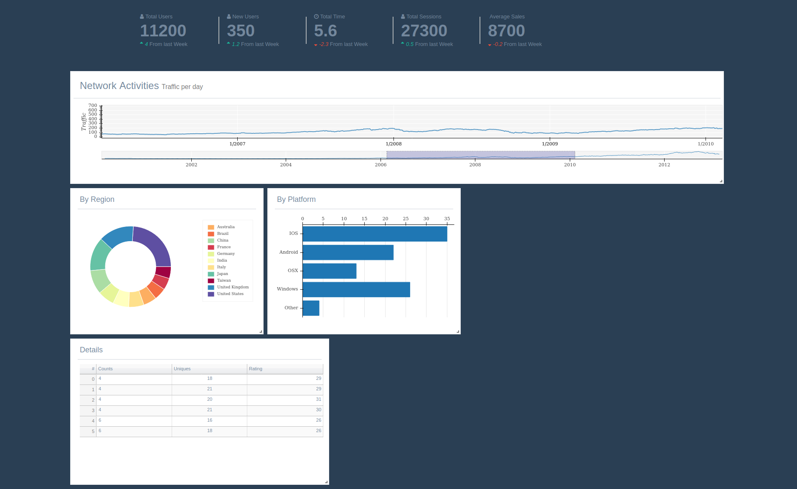

# Dashboard Example using React

This example creates a simple dashboard based on react-grid-layout using two techniques:
1. inline babel compiler scripts
2. precompiled react jsx bundles



## Setting Up

No additional packages or steps are required to run this example.

## Running

To view the app directly from a Bokeh server, navigate to the parent directory
[`examples/app`](https://github.com/bokeh/bokeh/tree/master/examples/app/dash-react-grid-layout),
and execute the command
```bash
    bokeh serve --show inline-example/
```
OR 
```bash
    bokeh serve --show precompiled-bundle-example/
```

Both examples should generate same dashboards, the two separate examples demonstrate two ways in which react can be embedded in html template files.


## Licences

This example uses vendored code from the following projects:

* https://fontawesome.com/license

* https://getbootstrap.com/docs/3.3/getting-started/

* https://github.com/puikinsh/gentelella/blob/master/LICENSE.txt
